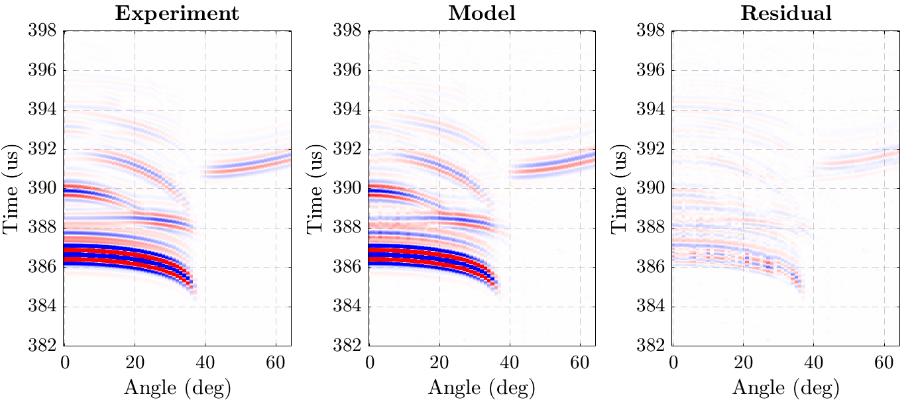

# Ultrasound property identification of isotropic materials based on angular $\theta$-scans

This repository implements the method presented in the article *Identification of viscoelastic material properties by ultrasonic angular measurements
in double through-transmission* by Poudrel & al. (submittted to the *Journal of the Acoustical Society of America*).

## How to get started ?
The main MATLAB script [`iTSCAN.m`](iTSCAN.m) contains all the necessary code to reproduce the results. 
A number of pre-formatted $\theta$-scans are provided in the [/data](/data) folder. 

## An example on pure VeroWhite

 
   

